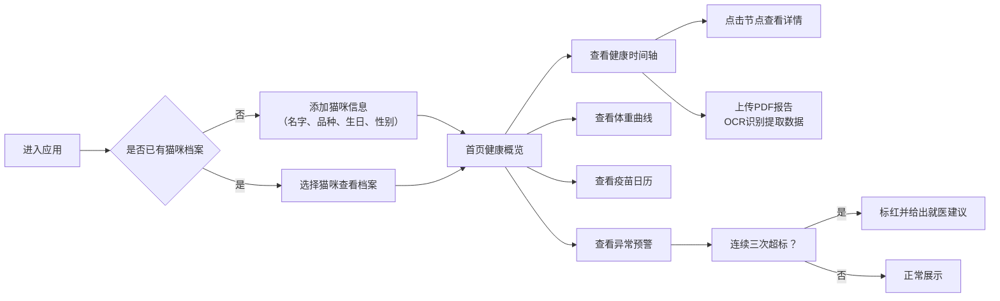

## 1. 产品概述

猫咪健康档案仪表盘是一款面向养猫家庭的健康管理工具，帮助铲屎官集中管理分散在各个医院的猫咪健康数据，通过可视化方式展现健康趋势，实现早发现、早干预。

- 解决痛点：68%养猫家庭无法准确描述猫咪近半年健康状况，病历分散在不同医院系统中
- 核心价值：一站式健康档案管理、智能异常预警、可视化健康趋势分析
- 目标用户：养猫家庭、宠物兽医

## 2. 核心功能

### 2.1 用户角色

| 角色 | 注册方式 | 核心权限 |
|------|----------|----------|
| 铲屎官 | 本地创建，无需注册 | 管理多只猫咪档案、上传报告、查看健康趋势 |
| 兽医 | 本地创建，无需注册 | 查看完整病史、辅助诊断 |

### 2.2 功能模块

1. **仪表盘首页**：猫咪选择器、健康概览卡片、异常预警提醒
2. **健康时间轴**：横向拖拽缩放、节点详情展开、PDF上传与OCR识别
3. **体重变化曲线**：ECharts折线图、同品种同年龄正常区间对比
4. **疫苗接种日历**：接种记录展示、下次接种提醒
5. **异常指标预警**：连续三次超标检测、自动标红、就医建议

### 2.3 页面详情

| 页面名称 | 模块名称 | 功能描述 |
|----------|----------|----------|
| 仪表盘首页 | 猫咪选择器 | 下拉切换不同猫咪档案，支持添加新猫咪 |
| 仪表盘首页 | 健康概览卡片 | 展示体重、年龄、品种、最近体检时间等关键信息 |
| 仪表盘首页 | 异常预警提醒 | 醒目展示需要关注的异常指标，点击跳转详情 |
| 健康时间轴 | 时间轴主体 | 横向展示所有健康事件，支持鼠标拖拽平移、滚轮缩放 |
| 健康时间轴 | 节点详情面板 | 点击时间节点展开，展示检查报告、疫苗记录、处方单详情 |
| 健康时间轴 | PDF上传组件 | 拖拽上传PDF报告，调用第三方OCR接口提取文字内容 |
| 体重曲线 | 折线图表 | 展示历史体重变化趋势，ECharts交互式图表 |
| 体重曲线 | 参考区间对比 | 阴影区域展示同品种同年龄猫咪的正常体重范围 |
| 疫苗日历 | 日历视图 | 按月份展示疫苗接种记录，标记已接种和待接种 |
| 疫苗日历 | 接种提醒 | 展示下次需要接种的疫苗类型和时间 |
| 异常预警 | 指标列表 | 展示各项健康指标的检测历史和正常范围 |
| 异常预警 | 超标检测 | 连续三次超出正常范围自动标红，给出就医建议 |

## 3. 核心流程

## 4. 用户界面设计

### 4.1 设计风格

**整体风格：温暖治愈系**

- **主色调**：暖橙色 `#FF8C42` - 代表温暖、活力，呼应猫咪的活泼性格
- **辅助色**：鼠尾草绿 `#7CB342` - 代表健康、自然，用于正常指标展示
- **警告色**：珊瑚红 `#EF5350` - 用于异常指标标红
- **背景色**：米白色 `#FFF8F0` - 柔和不刺眼，营造温馨氛围
- **卡片色**：纯白色 `#FFFFFF` - 信息层级分明
- **字体**：标题使用「ZCOOL KuaiLe」圆润可爱字体，正文使用「Noto Sans SC」易读性字体

**组件风格**：
- 按钮：大圆角（16px）、柔和阴影、悬停微放大动画
- 卡片：大圆角（20px）、浅投影、内层16px留白
- 图标：线性风格，统一使用lucide-react图标库，配合柔和色彩
- 动效：页面加载时卡片依次淡入，切换猫咪时数据平滑过渡

### 4.2 页面设计概述

| 页面名称 | 模块名称 | UI元素 |
|----------|----------|--------|
| 仪表盘首页 | 猫咪选择器 | 圆形猫咪头像、名字标签、下拉展开动画 |
| 仪表盘首页 | 健康概览卡片 | 四宫格布局，图标+数值+趋势箭头 |
| 仪表盘首页 | 异常预警卡片 | 红色渐变边框，感叹号图标，醒目提示 |
| 健康时间轴 | 时间轴主体 | 橙色时间主线，不同类型事件用不同颜色圆点标记 |
| 健康时间轴 | 节点详情 | 右侧滑入面板，半透明遮罩层 |
| 健康时间轴 | PDF上传区 | 虚线边框，拖拽进入时背景变浅橙 |
| 体重曲线 | 折线图表 | 橙色折线，绿色参考区间阴影，鼠标悬浮显示详情 |
| 疫苗日历 | 日历视图 | 网格布局，已接种打勾，待接种橙色圆点标记 |
| 异常预警 | 指标列表 | 表格布局，正常绿色文字，异常红色加粗背景 |

### 4.3 响应式

- **Desktop-first**设计，优先保证1920px大屏体验
- 响应式断点：1280px、768px、480px
- 移动端（<768px）：多列布局自动转为单列堆叠，时间轴改为垂直方向滚动
- 触摸优化：增大点击区域至44x44px，支持手指滑动时间轴

### 4.4 动效设计

- **页面入场**：卡片从下往上依次淡入，间隔80ms
- **时间轴交互**：拖拽时节点吸附对齐，释放时弹性回弹
- **数据更新**：数值变化时数字滚动动画，曲线平滑过渡
- **警告提示**：异常卡片轻微呼吸闪烁动画，吸引注意力但不干扰
- **错误边界**：模块崩溃时显示友好的猫咪插画和重试按钮
