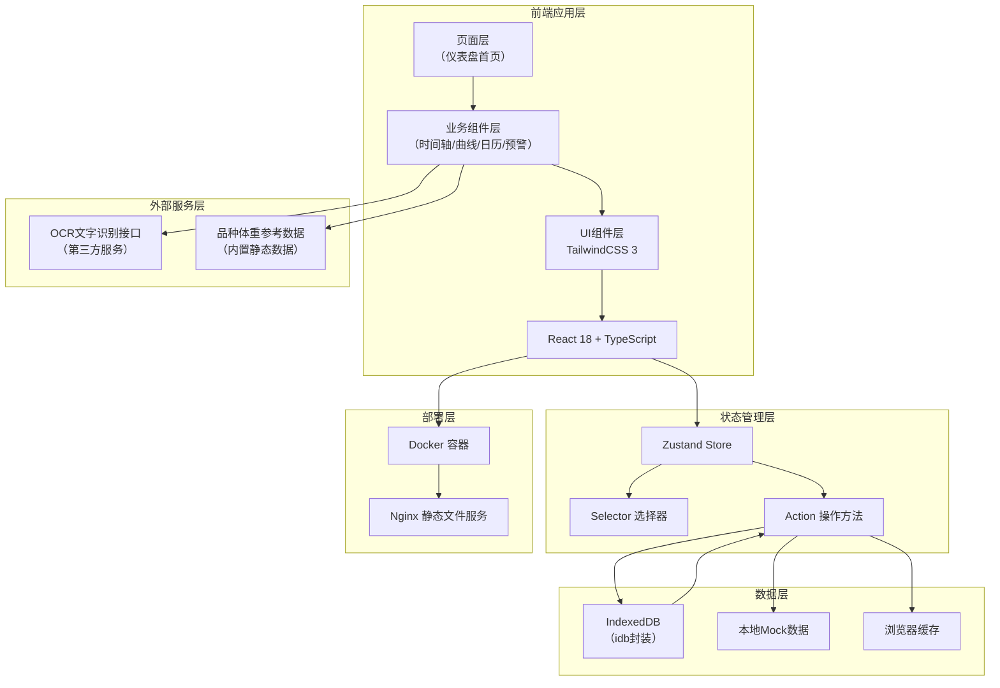
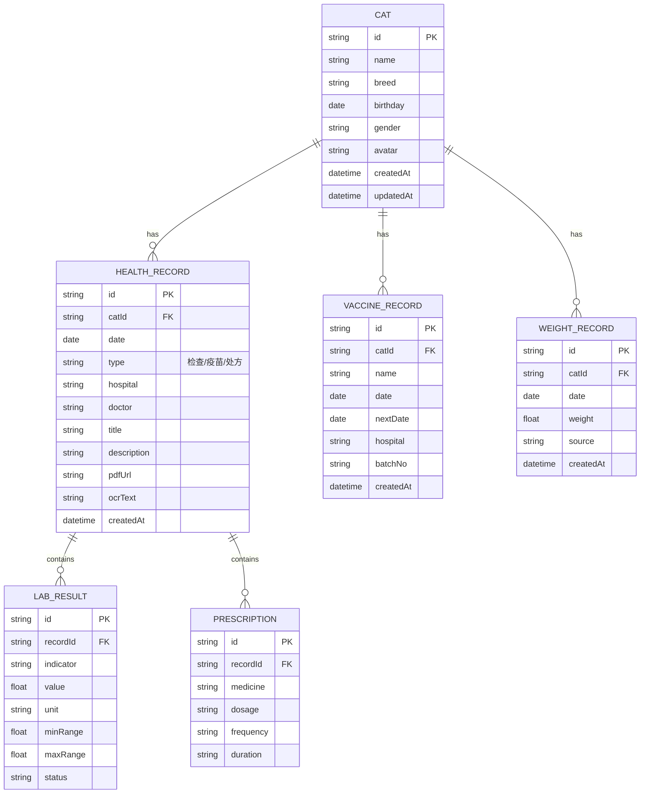

## 1. 架构设计



## 2. 技术描述

- **前端框架**：React 18 + TypeScript 5
- **构建工具**：Vite 5
- **样式方案**：TailwindCSS 3 + CSS Variables
- **状态管理**：Zustand 4
- **图表库**：ECharts 5 + echarts-for-react
- **本地数据库**：IndexedDB（idb库封装）
- **路由**：React Router DOM 6
- **图标**：lucide-react
- **PDF处理**：pdfjs-dist
- **错误边界**：React Error Boundary
- **HTTP客户端**：axios（OCR接口调用）
- **部署方案**：Docker + Nginx

## 3. 目录结构

```
src/
├── components/          # 可复用组件
│   ├── common/         # 通用组件（Button/Card/Modal等）
│   ├── timeline/       # 健康时间轴相关组件
│   ├── weight-chart/   # 体重曲线相关组件
│   ├── vaccine-calendar/ # 疫苗日历相关组件
│   ├── alert-panel/    # 异常预警相关组件
│   └── cat-selector/   # 猫咪选择器组件
├── pages/              # 页面组件
│   └── Dashboard/      # 仪表盘首页
├── store/              # Zustand状态管理
│   ├── catStore.ts     # 猫咪档案状态
│   ├── healthStore.ts  # 健康数据状态
│   └── index.ts        # Store聚合
├── db/                 # IndexedDB封装
│   ├── index.ts        # 数据库初始化
│   ├── catRepository.ts
│   ├── recordRepository.ts
│   └── vaccineRepository.ts
├── hooks/              # 自定义Hooks
│   ├── useTimelineDrag.ts
│   ├── useWeightAnalysis.ts
│   ├── useAlertDetection.ts
│   └── useOfflineStatus.ts
├── utils/              # 工具函数
│   ├── ocr.ts          # OCR接口封装
│   ├── breedData.ts    # 品种参考数据
│   ├── dateUtils.ts
│   └── errorHandler.ts
├── types/              # TypeScript类型定义
│   ├── cat.ts
│   ├── health.ts
│   └── index.ts
├── services/           # 外部服务
│   └── ocrService.ts
└── App.tsx
```

## 4. 路由定义

| 路由 | 页面 | 说明 |
|------|------|------|
| `/` | 仪表盘首页 | 包含所有功能模块的单页应用 |
| `/cat/:id` | 指定猫咪档案 | 直接跳转查看某只猫咪的档案 |

## 5. 数据模型

### 5.1 ER图



### 5.2 IndexedDB Object Stores

```typescript
// 数据库名：catHealthDB
// 版本：1

// Object Store: cats
{ keyPath: 'id', indexes: [{ name: 'name', unique: false }] }

// Object Store: healthRecords
{ keyPath: 'id', indexes: [{ name: 'catId', unique: false }, { name: 'date', unique: false }] }

// Object Store: weightRecords
{ keyPath: 'id', indexes: [{ name: 'catId', unique: false }, { name: 'date', unique: false }] }

// Object Store: vaccineRecords
{ keyPath: 'id', indexes: [{ name: 'catId', unique: false }, { name: 'date', unique: false }] }

// Object Store: labResults
{ keyPath: 'id', indexes: [{ name: 'recordId', unique: false }, { name: 'indicator', unique: false }] }

// Object Store: prescriptions
{ keyPath: 'id', indexes: [{ name: 'recordId', unique: false }] }
```

## 6. 状态管理设计

### 6.1 Cat Store

```typescript
interface CatState {
  cats: Cat[];
  currentCatId: string | null;
  isLoading: boolean;
  error: string | null;
  
  // Actions
  fetchCats: () => Promise<void>;
  addCat: (cat: Omit<Cat, 'id' | 'createdAt' | 'updatedAt'>) => Promise<void>;
  updateCat: (id: string, data: Partial<Cat>) => Promise<void>;
  deleteCat: (id: string) => Promise<void>;
  setCurrentCat: (id: string) => void;
}
```

### 6.2 Health Store

```typescript
interface HealthState {
  healthRecords: HealthRecord[];
  weightRecords: WeightRecord[];
  vaccineRecords: VaccineRecord[];
  labResults: LabResult[];
  selectedRecordId: string | null;
  timelineScale: number;
  timelineOffset: number;
  
  // Actions
  fetchRecords: (catId: string) => Promise<void>;
  addHealthRecord: (record: Omit<HealthRecord, 'id'>) => Promise<void>;
  addWeightRecord: (record: Omit<WeightRecord, 'id'>) => Promise<void>;
  addVaccineRecord: (record: Omit<VaccineRecord, 'id'>) => Promise<void>;
  addLabResults: (results: Omit<LabResult, 'id'>[]) => Promise<void>;
  updateOcrText: (recordId: string, text: string) => Promise<void>;
  deleteRecord: (recordId: string) => Promise<void>;
  selectRecord: (id: string | null) => void;
  setTimelineScale: (scale: number) => void;
  setTimelineOffset: (offset: number) => void;
  
  // Selectors
  getSortedHealthRecords: () => HealthRecord[];
  getWeightTrend: () => { date: string; weight: number }[];
  getAbnormalIndicators: () => { indicator: string; count: number; records: LabResult[] }[];
  getUpcomingVaccines: () => VaccineRecord[];
}
```

## 7. 外部服务接口

### 7.1 OCR文字识别接口

```typescript
// 第三方OCR服务（示例：百度OCR）
interface OCRService {
  extractTextFromPdf: (file: File) => Promise<{
    success: boolean;
    text: string;
    pages: number;
  }>;
}

// 请求配置
const OCR_CONFIG = {
  apiUrl: 'https://aip.baidubce.com/rest/2.0/ocr/v1/general_basic',
  apiKey: process.env.VITE_OCR_API_KEY || '',
  secretKey: process.env.VITE_OCR_SECRET_KEY || '',
};
```

### 7.2 品种体重参考数据（内置）

```typescript
// 常见猫咪品种体重参考范围（kg）
const BREED_WEIGHT_REFERENCE: Record<string, {
  male: { min: number; max: number };
  female: { min: number; max: number };
  growthCurve: { ageMonths: number; weight: number }[];
}> = {
  '英国短毛猫': {
    male: { min: 4.1, max: 7.7 },
    female: { min: 3.2, max: 5.4 },
    growthCurve: [...]
  },
  '美国短毛猫': { ... },
  '布偶猫': { ... },
  // 更多品种...
};
```

## 8. 关键技术实现要点

### 8.1 时间轴拖拽缩放

- 使用 `usePanZoom` 自定义Hook处理鼠标/触摸事件
- 支持滚轮缩放（minScale: 0.5, maxScale: 3.0）
- 支持鼠标拖拽平移（边界限制）
- 节点点击与拖拽的冲突处理（移动距离阈值5px）

### 8.2 异常指标检测算法

```typescript
function detectAbnormalIndicators(results: LabResult[]): AbnormalIndicator[] {
  const grouped = groupBy(results, 'indicator');
  const abnormal: AbnormalIndicator[] = [];
  
  for (const [indicator, records] of Object.entries(grouped)) {
    const sorted = sortByDate(records);
    let consecutiveCount = 0;
    
    for (let i = sorted.length - 1; i >= 0; i--) {
      const r = sorted[i];
      if (r.value < r.minRange || r.value > r.maxRange) {
        consecutiveCount++;
        if (consecutiveCount >= 3) {
          abnormal.push({
            indicator,
            consecutiveCount,
            latestRecords: sorted.slice(-3),
            suggestion: getMedicalAdvice(indicator)
          });
          break;
        }
      } else {
        consecutiveCount = 0;
      }
    }
  }
  
  return abnormal;
}
```

### 8.3 错误边界处理

- 为每个功能模块（时间轴、曲线、日历、预警）分别包裹ErrorBoundary
- 错误时展示降级UI（友好提示+重试按钮）
- 错误日志上报到控制台
- 不影响其他模块正常运行

### 8.4 离线支持

- IndexedDB存储所有数据，断网时从本地读取
- Service Worker缓存静态资源
- 上传OCR时检测网络状态，离线时保存到待同步队列
- 网络恢复后自动重试OCR识别

## 9. 部署架构

### 9.1 Dockerfile

```dockerfile
# 构建阶段
FROM node:18-alpine AS builder
WORKDIR /app
COPY package*.json ./
RUN npm ci
COPY . .
RUN npm run build

# 运行阶段
FROM nginx:alpine
COPY --from=builder /app/dist /usr/share/nginx/html
COPY nginx.conf /etc/nginx/conf.d/default.conf
EXPOSE 80
CMD ["nginx", "-g", "daemon off;"]
```

### 9.2 docker-compose.yml

```yaml
version: '3.8'
services:
  cat-health-dashboard:
    build: .
    ports:
      - "8080:80"
    restart: unless-stopped
```
